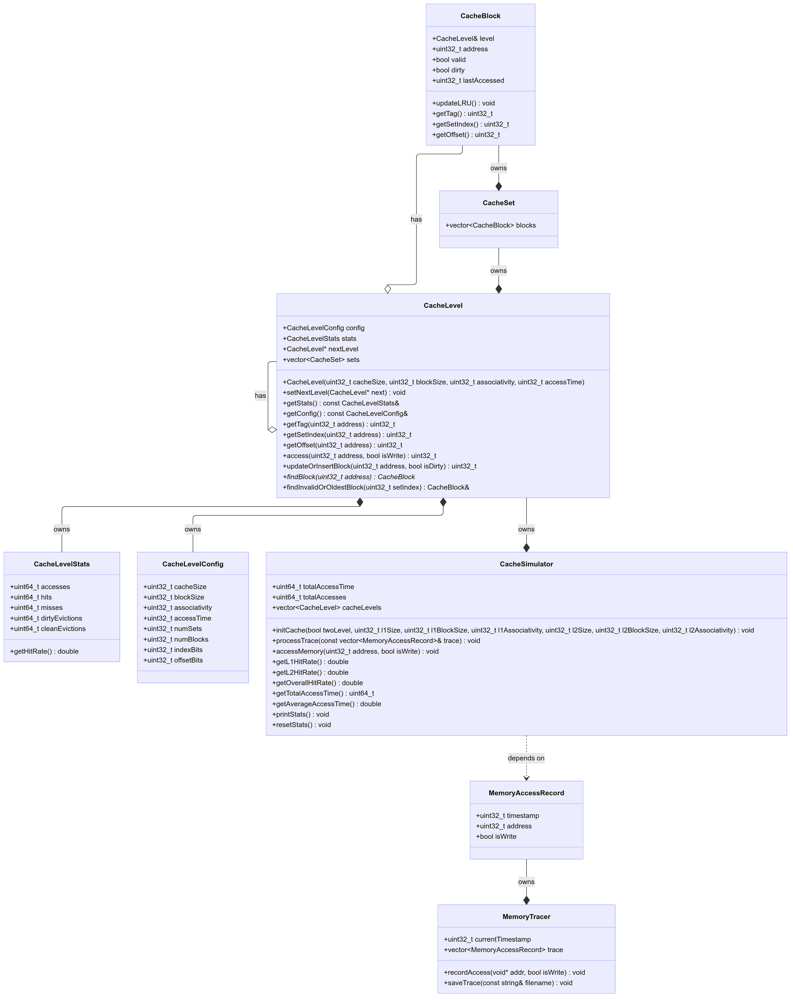
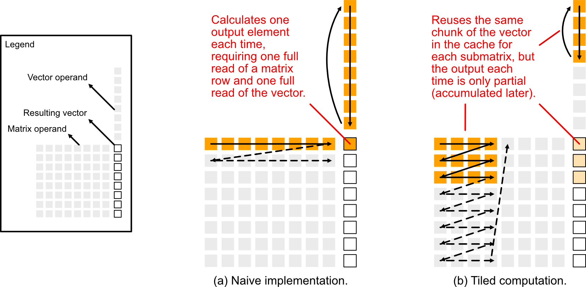

# COMP4611 Programming Assignment: Cache Performance Simulator

**Deadline: 16 May 2025 at 11:55 pm (HKT)**

In this project, you need to implement a **cache performance simulator** that allows you to experiment with different cache configurations and organisations and to evaluate their performance metrics. You then need to use your simulator to analyse the cache performance of different **workloads** and give recommendations to optimise them.

We'll provide you with the basic hardware characteristics of the cache and tell you about the cache designs that need to be supported. We'll also provide the workloads which will call the methods you implement in your simulator, so that it can capture the activities of our workload programs.

# The Simulator

Your simulator will contain two components: the **memory tracer** which allows you to log and print out the address and type (read/write) of each memory access, and the actual **cache performance simulator** which allows you to investigate cache access patterns and different cache designs while recording various performance metrics.

## Memory Tracer

The memory tracer is a simple class that allows you to log the address and type (read/write) of each memory access and save them to a file. We have provided its implementation in `memory_tracer.cpp` and you don't need to change it.

## Cache Performance Simulator

The cache performance simulator is a class that allows you to investigate cache access patterns and different cache designs. It takes in a trace of memory accesses and a cache configuration and then simulates the cache accesses, recording various metrics.

### Cache Configurations

The simulator needs to support the following cache configurations:

**Levels of Cache**:

- Single-level: L1 only; and
- Two-level: L1 and L2

For each level, it needs to support the following settings:

**Cache size**: Variable cache sizes, e.g., 32KiB, 64KiB, ...

**Block size**: Variable block sizes, e.g., 32 bytes, 64 bytes, ...

**Associativity**: Direct mapped and $n$-way set associative

**Replacement policy**: LRU

### Cache Characteristics

In addition, the cache simulated will have the following characteristics:

**Access time**:

- 1 nanosecond for L1; 10 nanoseconds for L2; 100 nanoseconds for main memory

**Cache behaviours**:

*NOTE 1: Since we focus on the cache performance, our cache simulator **doesn't** need to store/read/write the "actual data." We only need to accurately model the performance.*

*NOTE 2: For simplicity, our cache doesn't 100% resemble real world caches. If you found differences, please follow the instructions in this document.*

- Our cache is **write-back**, **write-allocate**, and non-inclusive-non-exclusive (i.e. **non-inclusive**: L2 cache does not need to include all the memory blocks present in L1 cache, **non-exclusive**: the cache at a particular level does not need to exclude all the memory blocks present in another level). This means that:
   - The CPU will only directly read/write data from/to the L1 cache. If an address is not in L1, it needs to be loaded into L1 first.
   - We don't assume whether some data in L1 is also in L2, so when we evict data from L1, we need to make sure it lands in L2 if it's not already there and up-to-date.
- Operations like looking up a block and checking its valid/dirty bits are fast, so we assume they take no time.
- Each reading/writing operation from/to the cache will incur the access time of that cache level. Note that:
   - There is no performance/timing difference between reading and writing operations.
   - Fetching data from a lower level and inserting it into a higher level will need a read (in the lower level) and then a write (in the higher level). This will incur the access time of the lower level + the higher level.
   - Writing back a block also takes the time of reading, and then writing.
   - On a cache miss, the data will need to be loaded all the way up to L1, and then the CPU will read/write from/to L1.
   - If you're writing to a block and simultaneously setting its valid/dirty bits, this is seen as a single operation and **will not incur** extra access time (i.e. only one access time to that cache level is incurred).

### Examples (it is basically describing the behavior of a <u>write-back</u>, <u>write-allocate</u> cache, use the total time calculated below to verify your understanding)

To help you verify your understanding, we have a few examples below where the system's behaviours are described step by step. These examples cover simple and also the most complicated scenarios, and they will also appear in our unit tests (more later). The number in the parentheses is the access time incurred for that step.

**Scenario 1**: Assume we have a one-level cache and the cache is currently empty. We want to read the data at address `0x1234`.

1. The block containing `0x1234` is searched for in L1, but it's not found. (0ns)
1. The block is read from the main memory. (100ns)
1. Since L1 is empty, there's no need to evict any block. (0ns)
1. The data is inserted into L1 and the block is marked as valid. (1ns)
1. The data at `0x1234` is finally read from L1. (1ns)
1. Done. **The total access time in this scenario is 102ns**.

**Scenario 2**: Assume we have a two-level cache. Assume L1 has the block `0x5678` and L2 has `0x1234`. Both blocks are not dirty (i.e. not modified and do not need to be written to the lower level cache/memory according to the write-back policy employed). We want to read the data at address `0x1234`.

1. The block containing `0x1234` is searched for in L1, but it's not found. (0ns)
1. The block is searched for in L2, and it's found. (0ns)
1. The data at `0x1234` is read from L2. (10ns)
1. Assume L1 is full now and assume the block `0x5678` is chosen as victim and evicted to L2 (assume it is not already present in the L2). so `0x5678` is read from L1 waiting to be copied to L2. (1ns)
1. Since L2 is also full, suppose we find that we need to evict `0x1234` from L2 before we can evict `0x5678` into L2 (i.e. assume 0x1234 and  0x5678 are assigned the same space in the L2 cache). But since the block is clean, we don't need to write it back to the main memory. It's simply discarded. (0ns)
1. The block `0x5678` is inserted into L2. (10ns)
1. Now we can insert `0x1234` into L1, overwriting the cache block's content. (1ns)
1. The data at `0x1234` is finally read from L1. (1ns)
1. Done. **The total access time in this scenario is 23ns**.

**Scenario 3**: Assume we have a two-level cache. Assume L1 has the block `0x5678` and L2 has `0x1234`. Both blocks are **dirty**. The CPU wants to write to the data inside the block `0x0000`.

1. The block containing `0x0000` is searched for in L1, but it's not found. (0ns)
1. The block is searched for in L2, but it's not found. (0ns)
1. The data at `0x0000` is read from the main memory. (100ns)
1. Since L2 is full and the block `0x1234` is dirty, we find that we need to write the block `0x1234` from L2 back to the main memory before we can bring `0x0000` into L2, so `0x1234` is read from L2 and written back to the main memory. (10ns+100ns)
1. The block `0x0000` is inserted into L2. (10ns)
1. The block `0x0000` is read from L2 to prepare for the insertion into L1. (10ns)
1. Assume that L1 is full, and we find that we need to write the block `0x5678` from L1 back to L2 before we can bring `0x0000` into L1,  and the block `0x5678` is dirty (i.e. needed to be written to the lower level L2) so `0x5678` is read from L1. (1ns)
1. Assume L2 is full again (containing the block `0x0000` we just brought from the main memory), assume that we need to evict `0x0000` from L2 to make room for `0x5678` coming from L1. Since the block `0x0000` is just brought from the memory and is not dirty, we don't need to write it back to the main memory. It's simply discarded. (0ns)
1. The block `0x5678` is inserted into L2. (10ns)
1. The block `0x0000` is inserted into L1. (1ns)
1. The data inside the block `0x0000` is updated in L1, its dirty bit also being set. (1ns)
1. Done. **The total access time in this scenario is 243ns**.

## Tasks

Once you have finished your implementation, you can use your simulator to do the following tasks and answer the questions.

### Task 0: Basic Tests

Run the unit tests using the command `make test` and show its output (screenshot) **on the answer sheet**.

### Task 1: Arrays and Linked Lists

In this task, you'll have the opportunity to test your implementation and do some basic analysis. You'll work with two workloads provided by us, which access data in an array and a linked list, respectively.

First, run the two workloads and record the memory traces (just run the command `make run` and select task 1). Show a sample (screenshot) of each of the traces **on the answer sheet** (you can find them in the `*_trace.txt` files generated after running the workloads).

Then, feed the traces into your simulator with the following cache configurations (these will also be automatically done after you select task 1 in the menu; just pay attention to the output):

1. 32KiB L1-only cache, 32 bytes block size, direct mapped
2. A multi-level cache with:
    - L1 cache: 32KiB, 32 bytes block size, 4-way set associative
    - L2 cache: 64KiB, 64 bytes block size, 8-way set associative

For each configuration, show the simulator's performance metrics (screenshot) **on the answer sheet**.

Answer the following questions **on the answer sheet**:

- For each workload, which configuration has the better performance in terms of total memory access time?
- For each given configuration, which workload is more cache-friendly (i.e. has lower memory access time)? Why?

### Task 2: Steps and Set Associativity

In this task, you are provided with two workloads that update the elements in an array repeatedly at different strides. Use the simulator with the following configurations to run the workloads (run the command `make run` and select task 2):

- L1-only cache, 32KiB, 64 bytes block size, 4-way set associative

Record the metrics of the cache simulator (screenshot) **on the answer sheet** and answer the following questions:

- Which workload finishes faster? Why is there a difference in performance?
- For the slower workload, experiment with other configurations of set associativity (1, 2, 8, 16) and show the metrics.
    - Which configuration gives the best performance? Why?
    - Why do the remaining configurations perform worse? What bad things are happening?
- What does this task tell you about the selection of set associativity?

## Project Organisation and Implementation Guide

### Project Structure

The project is organised as follows:

- `simulator/`: Contains the implementation of the memory tracer and cache simulator
  - `memory_tracer.h/cpp`: Implementation of the memory tracer component
  - `cache_simulator.h/cpp`: Implementation of the cache simulator component
- `workloads/`: Contains the workload implementations for different test cases
  - `array_and_list.cpp`: Workload for Task 1 (array and linked list access patterns)
  - `stride_workloads.cpp`: Workload for Task 2 (stride patterns)
  - `matrix_vector.cpp`: Workload for (the optional) Task 3 (matrix-vector multiplication)
- `tests/`: Contains the unit tests for the cache simulator implementation
  - `cache_simulator_tests.cpp`: Tests for the cache simulator functions
- `build/`: Generated directory for build artifacts
- `*_trace.txt`: Memory trace files (generated by running the workloads)

### How to Compile and Run

First, open the project (folder) in your favourite IDE or editor. If you're using VS Code, you can refer to this [page](https://course.cse.ust.hk/comp2011/vscode/) to set it up. If you are having problem setting up the project and need help, please make sure you're using the VS Code setup provided in the previous sentence. Otherwise, we may not be able to troubleshoot the issue for you.

In this project, we've set up a [Makefile](https://en.wikipedia.org/wiki/Make_\(software\)\#Makefile) (located at `./Makefile`) to make it easier to compile and run the project. In order to use it, you can type the following commands after opening a **terminal** in VS Code (if you forgot know how to do that, search for "terminal" in [this page](https://course.cse.ust.hk/comp2011/vscode/)), or opening your other favourite terminal if you prefer:

1. **Compile the project (optional because it's also automatically done by step 2 and 3)**:
   ```bash
   make
   ```

2. **Run the unit tests (strongly recommended)**:
   ```bash
   make test
   ```
   This will run all the unit tests for the cache simulator implementation. We **strongly recommend** you to run the unit tests during your implementation to catch issues early. Note that the unit tests are not exhaustive, so passing all tests doesn't necessarily mean your implementation is 100% correct.

3. **Run the workloads**:
   ```bash
   make run
   ```
   Which will display a menu where you can select which task(s) to run. If using VS Code, you may want to maximise the terminal window to see the output better.

4. **Clean the built and generated files (do this before submitting)**:
   ```bash
   make clean
   ```
   This will remove all the built and generated files. You can also try running this if you're seeing weird errors you don't think should happen.

### Implementation Guide

You need to implement a few components by looking for functions/places marked with `TODO_IMPLEMENT_ME;` in the following files:

1. `simulator/cache_simulator.cpp`
2. `workloads/matrix_vector.cpp`
3. In `main.cpp`
   - There is a part in `runTask2` where you need to propose the improved configuration for the workload that is slower.

After implement those functionalities, just remove the `TODO_IMPLEMENT_ME;` from the code. Don't worry - if you forgot to implement something, the code will complain and tell you what is missing.

We've implemented all other methods for you and you can use them as references when implementing the remaining. For the unimplemented methods in `simulator/cache_simulator.cpp`, you can see their documentation in `simulator/cache_simulator.cpp` and `simulator/cache_simulator.h`, which should help you understand their functionalities.

We have also provided unit tests for you to test your implementation. We **strongly recommend** you to run the unit tests during your implementation to catch issues early. Note that the unit tests are not exhaustive, so passing all tests doesn't necessarily mean your implementation is 100% correct. You can refer to the "Project Structure" section to see where they are and the "How to Compile and Run" section to see how to run them.

### Implementation Tips & FAQs

- **Documentation**: Refer to the in-code documentation (especially in `cache_simulator.h` and `cache_simulator.cpp`) for detailed explanations of how each method should behave and what parameters mean.

- **Unit Testing**: We **strongly recommend** you to run the unit tests during your implementation to catch issues early. Note that the unit tests are not exhaustive, so passing all tests doesn't necessarily mean your implementation is 100% correct. You can refer to the "Project Structure" section to see where they are and the "How to Compile and Run" section to see how to run them.

- **Address Handling**: For simplicity, addresses are trimmed down to 32 bits, which is enough for the simulation.

- **About the Skeleton**: The code skeleton we provided with you is certainly not the only way to design and implement a cache simulator. While you may think of different approaches when looking at the problem (e.g., using a recursive design), we think the current design is easier to understand and debug for all, so we request you to follow it.

- **Weird Errors**: If you encounter weird errors you don't think could occur, try to clean the built and generated files using the `make clean` command and then compile again.

### UML Diagram

We heard that some of you might find this helpful, so here's a UML diagram of the cache simulator for your reference:

<div style="page-break-after: always;"></div>



<div style="page-break-after: always;"></div>

### Submission

**Deadline: 16 May 2025 at 11:55 pm (HKT)**

You need to submit your answers to the questions on the answer sheet, **together with** the source code all in one zip file. Before submitting, please make sure:

- You have tested your implementation using the unit tests (`make test`).
- You have cleaned the built and generated files using the `make clean` command.
- You have exported your answer sheet to PDF (to avoid formatting problems).
- You have named the zip file `<Your Student ID>.zip`.

<div style="page-break-after: always;"></div>

## Appendix

> ‼️ In this appendix, we include an extra task (in matrix_vector.cpp) for you if you want to think more about the relationship between hardware and software. It's for your own exercise only. **It's not in the answer sheet and we will not grade it. It has no influence on your grades. This will also not appear in exams**.

## Task 3: Cache-Efficient Code

In this fun task, you'll think from the perspective of programmers instead of hardware designers. You're provided with a naive implementation (in `workloads/matrix_vector.cpp`) for **matrix-vector multiplications** and you're guided to improve its performance.

First, set up your simulator with the following cache configuration, run the workload (task 3 in the menu), and take a look at the cache performance metrics for the naive implementation:

- L1-only cache, 32KiB, 64 bytes block size, 4-way set associative

In this naive implementation (illustrated on the left in the below image), we're accessing the matrix row by row and calculating one output element at a time. This is how we (human) typically do matrix-vector multiplications. But notice this naive implementation is slow, because there're too many cache misses: When calculating each element in the result vector, you need to iterate through one row of the matrix and traverse *all* elements of the vector. Since the matrix and vector in our workload are quite large, this means that previous elements of the vector may have been *evicted* from the cache to make space for later elements. And when you reach the next row of the matrix, the earlier elements of the vector need to be loaded into cache again.



To improve this, there is a common technique called *tiling*, as illustrated on the right in the above image. The idea is to divide the matrix into smaller sub-matrices (and the vector into smaller chunks), and do the calculations in tiles. This works better because the same chunk of the vector in the cache can be *reused* while you iterate through the rows of each smaller sub-matrix. In this method, you're only calculating part of the output elements with each tile, so you need to add up the results at the end. If you want some more reading (with visualisations) on this topic, you can take a look at this [blog post](https://alvinwan.com/how-to-tile-matrix-multiplication/).

Implement the tiling technique in the `betterImpl` function in `workloads/matrix_vector.cpp`. Note that:

- Don't forget to add memory tracer hooks properly.
- For simplicity, we'll **only** consider and implement tiling along the row dimension of the matrix, i.e., only "vertically cutting" the matrix into columns, instead of splitting it into squares.
- You also **don't** need to handle the case where the number of columns of the matrix is not divisible by the number of tiles, because that won't happen in our setup.
- Like the naive implementation, you don't need to record accesses during the initialisation process.
- For a result vector element, you need one read and one write in order to *add* a value to it. But if you're just *setting* its value, you only need one write and no read.
- **Hint**: If you're unsure how to write the code, consider getting some inspiration from the naive implementation. Actually you don't need to change much of it to arrive at the final solution.

Once done, answer the following questions:

- Split the matrix into 2, 4, 8, and 16 columns respectively. What are the cache performance metrics after the optimisation and how do they compare to the naive implementation?
- Looking at the (different) metrics, which tiling configuration would you recommend for this workload? Briefly explain your reasoning.
